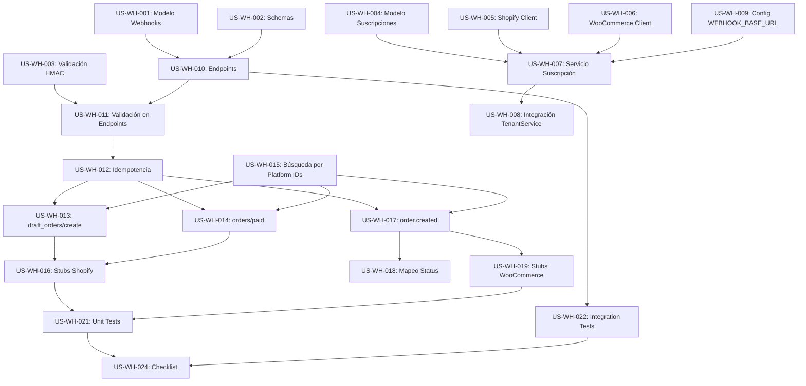

# Historias de Usuario - Sistema de Webhooks Multitenant

> Sistema completo de webhooks para recibir eventos de Shopify y WooCommerce, con soporte multitenant, validación de firmas, idempotencia y manejo automático de órdenes.

**Fecha**: 2026-01-27
**Versión**: 1.0
**Estimación Total**: ~30 horas (4 días)

---

## Épica 1: Infraestructura de Webhooks

### US-WH-001: Modelo de Logs de Webhooks

**Como** desarrollador del sistema
**Quiero** tener un modelo que registre todos los webhooks recibidos
**Para** auditar eventos, hacer debugging y prevenir duplicados

#### Criterios de Aceptación
- [x] Existe tabla `webhook_events` en PostgreSQL
- [x] Guarda payload completo en formato JSONB
- [x] Almacena firma HMAC recibida
- [x] Registra si la firma fue validada correctamente
- [x] Marca eventos como procesados/no procesados
- [x] Relaciona eventos con órdenes creadas
- [x] Previene duplicados usando índice único en `platform + event_id`
- [x] Tiene índices para queries por tenant, plataforma y tipo de evento

#### Tareas Técnicas
- [x] Crear `apps/backend/app/models/webhook.py` con modelo `WebhookEvent`
- [x] Crear migración Alembic para tabla `webhook_events`
- [x] Aplicar migración: `uv run alembic upgrade head`
- [x] Crear `apps/backend/app/repositories/webhook.py`
- [x] Agregar métodos: `get_by_event_id()`, `get_unprocessed()`

#### Definición de Completado
- Migración aplicada sin errores
- Pueden insertarse eventos en la tabla
- Query por event_id funciona correctamente
- Índice único previene duplicados

---

### US-WH-002: Schemas de Webhooks

**Como** desarrollador del sistema
**Quiero** tener schemas Pydantic para webhooks de Shopify y WooCommerce
**Para** validar y documentar la estructura de datos de eventos

#### Criterios de Aceptación
- [x] Schemas para eventos Shopify: DraftOrder, Order
- [x] Schemas para eventos WooCommerce: Order
- [x] Schema genérico para crear logs de webhooks (`WebhookEventCreate`)
- [x] Schema para respuesta de procesamiento (`WebhookProcessingResult`)
- [x] Usa tipos literales para plataformas (`"shopify" | "woocommerce"`)
- [x] Documentación clara de cada campo

#### Tareas Técnicas
- [x] Crear `apps/backend/app/schemas/webhook.py`
- [x] Implementar `ShopifyDraftOrder`, `ShopifyOrder`
- [x] Implementar `WooCommerceOrder`
- [x] Implementar `WebhookEventCreate`, `WebhookEventResponse`
- [x] Implementar `WebhookProcessingResult`

#### Definición de Completado
- Todos los schemas validan correctamente
- Documentación generada en OpenAPI/Swagger
- Tests de validación pasan

---

### US-WH-003: Validación de Firmas HMAC

**Como** administrador del sistema
**Quiero** validar firmas HMAC de webhooks
**Para** garantizar que solo procesamos eventos auténticos de las plataformas

#### Criterios de Aceptación
- [x] Valida firma Shopify (X-Shopify-Hmac-Sha256)
- [x] Valida firma WooCommerce (X-WC-Webhook-Signature)
- [x] Usa comparación constant-time para prevenir timing attacks
- [x] Retorna true/false sin lanzar excepciones
- [x] Maneja errores de encoding/formato correctamente
- [x] Loguea intentos de validación fallidos

#### Tareas Técnicas
- [x] Crear `apps/backend/app/core/webhook_signature.py`
- [x] Implementar `verify_shopify_webhook()`
- [x] Implementar `verify_woocommerce_webhook()`
- [x] Usar HMAC-SHA256 con base64
- [x] Agregar unit tests con firmas válidas e inválidas

#### Definición de Completado
- [x] Tests con firmas válidas pasan
- [x] Tests con firmas inválidas fallan correctamente
- [x] No hay vulnerabilidades de timing

---

## Épica 2: Suscripción Automática de Webhooks

### US-WH-004: Modelo de Suscripciones de Webhooks

**Como** administrador del sistema
**Quiero** trackear las suscripciones de webhooks creadas programáticamente
**Para** gestionar, verificar y eliminar suscripciones cuando sea necesario

#### Criterios de Aceptación
- [x] Existe tabla `webhook_subscriptions` en PostgreSQL
- [x] Guarda ID de suscripción de la plataforma
- [x] Almacena URL de callback completa
- [x] Relaciona suscripción con tenant
- [x] Previene duplicados: un tenant no puede tener 2 suscripciones al mismo evento
- [x] Constraint único en `(tenant_id, platform, topic)`

#### Tareas Técnicas
- [x] Crear `apps/backend/app/models/webhook_subscription.py`
- [x] Crear migración Alembic para tabla `webhook_subscriptions`
- [x] Aplicar migración
- [x] Crear `apps/backend/app/repositories/webhook_subscription.py`
- [x] Métodos: `get_by_tenant_platform()`, `get_by_tenant_platform_topic()`

#### Definición de Completado
- Migración aplicada sin errores
- Constraint único funciona correctamente
- Pueden insertarse y consultarse suscripciones

---

### US-WH-005: Extensión de Shopify Client con Webhooks

**Como** desarrollador del sistema
**Quiero** crear suscripciones de webhooks en Shopify vía GraphQL
**Para** automatizar la configuración de webhooks cuando un tenant configura credenciales

#### Criterios de Aceptación
- [x] Método `create_webhook_subscription()` usa mutation `webhookSubscriptionCreate`
- [x] Recibe topic y callback_url como parámetros
- [x] Retorna ID de suscripción creada
- [x] Maneja errores de GraphQL (userErrors)
- [x] Topics en formato UPPERCASE (ej: `DRAFT_ORDERS_CREATE`)
- [x] Método `delete_webhook_subscription()` para cleanup

#### Tareas Técnicas
- [x] Modificar `apps/backend/app/integrations/shopify_client.py`
- [x] Implementar `create_webhook_subscription()`
- [x] Implementar `delete_webhook_subscription()`
- [x] Agregar tests con mocks de Shopify API

#### Definición de Completado
- [x] Suscripción se crea exitosamente en Shopify
- [x] Retorna GID de suscripción
- [x] Errores de API se manejan correctamente

---

### US-WH-006: Extensión de WooCommerce Client con Webhooks

**Como** desarrollador del sistema
**Quiero** crear webhooks en WooCommerce vía REST API
**Para** automatizar la configuración de webhooks cuando un tenant configura credenciales

#### Criterios de Aceptación
- [x] Método `create_webhook()` usa `POST /webhooks`
- [x] Recibe topic, delivery_url y secret como parámetros
- [x] Retorna webhook creado con ID numérico
- [x] Topics en formato lowercase (ej: `order.created`)
- [x] Método `delete_webhook()` para cleanup
- [x] Método `get_webhook()` para verificación

#### Tareas Técnicas
- [x] Modificar `apps/backend/app/integrations/woocommerce_client.py`
- [x] Implementar `create_webhook()`
- [x] Implementar `delete_webhook()`
- [x] Implementar `get_webhook()`
- [x] Agregar tests con mocks de WooCommerce API

#### Definición de Completado
- [x] Webhook se crea exitosamente en WooCommerce
- [x] Retorna ID numérico del webhook
- [x] Secret se configura correctamente

---

### US-WH-007: Servicio de Suscripción de Webhooks

**Como** desarrollador del sistema
**Quiero** un servicio centralizado para gestionar suscripciones de webhooks
**Para** automatizar la creación de todas las suscripciones necesarias para cada plataforma

#### Criterios de Aceptación
- [x] Método `subscribe_shopify_webhooks()` crea 7 suscripciones
- [x] Método `subscribe_woocommerce_webhooks()` crea 3 suscripciones
- [x] Verifica si suscripción ya existe antes de crear (idempotencia)
- [x] Guarda cada suscripción en tabla `webhook_subscriptions`
- [x] Construye callback URL usando `WEBHOOK_BASE_URL + /api/v1/webhooks/{platform}/{tenant_id}`
- [x] Continúa con otras suscripciones si una falla
- [x] Métodos de cleanup: `unsubscribe_shopify_webhooks()`, `unsubscribe_woocommerce_webhooks()`

#### Tareas Técnicas
- [x] Crear `apps/backend/app/services/webhook_subscription_service.py`
- [x] Implementar `subscribe_shopify_webhooks()`
- [x] Implementar `subscribe_woocommerce_webhooks()`
- [x] Implementar `unsubscribe_shopify_webhooks()`
- [x] Implementar `unsubscribe_woocommerce_webhooks()`
- [x] Agregar constantes para topics de cada plataforma
- [x] Unit tests para cada método

#### Definición de Completado
- [x] Se crean todas las suscripciones para Shopify (7)
- [x] Se crean todas las suscripciones para WooCommerce (3)
- [x] Idempotencia funciona: llamar dos veces no crea duplicados
- [x] Logs muestran suscripciones creadas

---

### US-WH-008: Integración con TenantService

**Como** administrador del sistema
**Quiero** que las suscripciones de webhooks se creen automáticamente
**Para** que los tenants no tengan que configurar webhooks manualmente

#### Criterios de Aceptación
- [x] Al guardar credenciales Shopify, se auto-suscriben webhooks
- [x] Al guardar credenciales WooCommerce, se auto-suscriben webhooks
- [x] Se genera `webhook_secret` aleatorio si no se provee
- [x] Secret se almacena encriptado en `tenant.settings`
- [x] Validación de credenciales antes de guardar
- [x] Si suscripción falla, credenciales igualmente se guardan
- [x] Logs muestran éxito/fallo de suscripciones

#### Tareas Técnicas
- [x] Modificar `apps/backend/app/services/tenant.py`
- [x] Crear/modificar método `update_ecommerce_settings()`
- [x] Generar webhook_secret con `secrets.token_urlsafe(32)`
- [x] Llamar a `webhook_subscription_service.subscribe_*_webhooks()`
- [x] Manejar errores sin fallar toda la operación
- [x] Agregar tests de integración

#### Definición de Completado
- [x] Guardar credenciales Shopify crea 7 suscripciones
- [x] Guardar credenciales WooCommerce crea 3 suscripciones
- [x] Webhook_secret se genera y guarda
- [x] Flow end-to-end funciona sin errores

---

### US-WH-009: Configuración de WEBHOOK_BASE_URL

**Como** DevOps/Administrador
**Quiero** configurar la URL base para webhooks
**Para** que las plataformas sepan dónde enviar los eventos

#### Criterios de Aceptación
- [x] Variable de entorno `WEBHOOK_BASE_URL` en config
- [x] Ejemplo en `.env.example`
- [x] Usado para construir callback URLs
- [x] Fallback a primer CORS origin si no se configura
- [x] Debe ser HTTPS en producción

#### Tareas Técnicas
- [x] Agregar campo en `apps/backend/app/core/config.py`
- [x] Documentar en `apps/backend/.env.example`
- [x] Usar en `webhook_subscription_service`

#### Definición de Completado
- [x] Variable se lee correctamente del environment
- [x] Callback URLs se construyen correctamente
- [x] Documentación clara en .env.example

---

## Épica 3: Recepción y Validación de Webhooks

### US-WH-010: Endpoints de Recepción de Webhooks

**Como** plataforma externa (Shopify/WooCommerce)
**Quiero** enviar eventos a URLs específicas por tenant
**Para** notificar al sistema cuando ocurren cambios en órdenes

#### Criterios de Aceptación
- [x] Endpoint `POST /api/v1/webhooks/shopify/{tenant_id}`
- [x] Endpoint `POST /api/v1/webhooks/woocommerce/{tenant_id}`
- [x] Valida tenant existe y está activo
- [x] Valida tenant tiene credenciales configuradas
- [x] Extrae headers requeridos (firma HMAC, topic)
- [x] Lee raw body para validación de firma
- [x] Retorna 200 OK si procesa correctamente
- [x] Retorna 401 si firma es inválida
- [x] Retorna 404 si tenant no existe

#### Tareas Técnicas
- [x] Crear `apps/backend/app/api/v1/endpoints/webhooks.py`
- [x] Implementar `receive_shopify_webhook()`
- [x] Implementar `receive_woocommerce_webhook()`
- [x] Registrar router en `apps/backend/app/api/v1/api.py`
- [x] Tests de endpoints con firmas válidas/inválidas

#### Definición de Completado
- ✅ Endpoints responden a POST requests
- ✅ Validación de tenant funciona
- ✅ Headers se extraen correctamente
- ✅ Logs muestran webhooks recibidos

---

### US-WH-011: Validación de Firmas en Endpoints

**Como** administrador del sistema
**Quiero** rechazar webhooks con firmas inválidas
**Para** proteger el sistema de eventos maliciosos o alterados

#### Criterios de Aceptación
- [x] Extrae `webhook_secret` de tenant settings
- [x] Usa `verify_shopify_webhook()` o `verify_woocommerce_webhook()`
- [x] Si firma es inválida, retorna 401 Unauthorized
- [x] Loguea webhook con `signature_valid=false`
- [x] No procesa evento si firma es inválida
- [x] Retorna mensaje de error claro

#### Tareas Técnicas
- [x] En endpoint, obtener webhook_secret de tenant
- [x] Llamar a función de validación con raw body
- [x] Manejar caso de firma inválida
- [x] Agregar tests con firmas incorrectas

#### Definición de Completado
- ✅ Webhooks con firma válida pasan
- ✅ Webhooks con firma inválida retornan 401
- ✅ Evento se loguea incluso si firma es inválida

---

### US-WH-012: Idempotencia de Webhooks

**Como** administrador del sistema
**Quiero** que eventos duplicados no se procesen múltiples veces
**Para** evitar crear órdenes duplicadas cuando la plataforma reintenta

#### Criterios de Aceptación
- [x] Verifica si `event_id` ya fue procesado
- [x] Si evento ya procesado, retorna 200 OK sin procesar
- [x] Mensaje: "Event already processed (idempotent)"
- [x] Query eficiente usando índice en `(platform, event_id)`
- [x] Funciona para Shopify y WooCommerce

#### Tareas Técnicas
- [x] En endpoint, extraer `event_id` del payload
- [x] Llamar a `webhook_repository.get_by_event_id()`
- [x] Verificar si `processed=true`
- [x] Si ya procesado, retornar early
- [x] Tests con eventos duplicados

#### Definición de Completado
- ✅ Primer webhook crea orden
- ✅ Segundo webhook con mismo ID no crea duplicado
- ✅ Retorna 200 OK en ambos casos
- ✅ Logs muestran "already processed"

---

## Épica 4: Procesamiento de Eventos Shopify

### US-WH-013: Procesamiento de draft_orders/create

**Como** sistema
**Quiero** crear órdenes automáticamente cuando Shopify crea un draft order
**Para** reemplazar el flujo manual de n8n

#### Criterios de Aceptación
- [x] Extrae datos del draft order del payload
- [x] Crea orden en BD con `shopify_draft_order_id`
- [x] Extrae customer info (email, nombre)
- [x] Marca orden como `validado=false`, `status="Pendiente"`
- [x] Verifica idempotencia (no crea duplicados)
- [x] Actualiza webhook_event con `processed=true` y `order_id`
- [x] Loguea éxito/error

#### Tareas Técnicas
- [x] En `webhook_service.py`, implementar `process_shopify_draft_order_create()`
- [x] Verificar si orden ya existe con `get_by_shopify_draft_id()`
- [x] Crear OrderCreate schema con datos del payload
- [x] Llamar a `order_repository.create()`
- [x] Actualizar webhook_event
- [x] Unit tests con payload real de Shopify

#### Definición de Completado
- ✅ Webhook crea orden en BD
- ✅ Orden tiene shopify_draft_order_id correcto
- ✅ Customer info se extrae correctamente
- ✅ No crea duplicados

---

### US-WH-014: Procesamiento de orders/paid

**Como** sistema
**Quiero** marcar órdenes como pagadas cuando Shopify confirma el pago
**Para** actualizar automáticamente el estado sin intervención manual

#### Criterios de Aceptación
- [x] Busca orden por `shopify_order_id`
- [x] Si no existe, busca por `shopify_draft_order_id` derivado
- [x] Actualiza orden: `validado=true`, `status="Pagado"`, `validated_at=now()`
- [x] Marca webhook_event como procesado
- [x] Si orden no existe, loguea warning y falla gracefully
- [x] Loguea éxito/error

#### Tareas Técnicas
- [x] En `webhook_service.py`, implementar `process_shopify_orders_paid()`
- [x] Usar `get_by_shopify_order_id()` primero
- [x] Fallback a búsqueda por email/precio si no encuentra
- [x] Actualiza orden directamente (no usa OrderUpdate)
- [x] Guarda shopify_order_id en la orden
- [x] Unit tests con diferentes escenarios

#### Definición de Completado
- ✅ Webhook actualiza orden existente
- ✅ Estado cambia a "Pagado"
- ✅ validado=true
- ✅ Si orden no existe, no crashea

---

### US-WH-015: Búsqueda de Órdenes por IDs de Plataforma

**Como** sistema
**Quiero** buscar órdenes eficientemente por IDs de Shopify/WooCommerce
**Para** relacionar webhooks con órdenes existentes

#### Criterios de Aceptación
- [x] Método `get_by_shopify_draft_id(tenant_id, draft_order_id)`
- [x] Método `get_by_shopify_order_id(tenant_id, order_id)`
- [x] Método `get_by_woocommerce_order_id(tenant_id, woo_order_id)`
- [x] Filtra por tenant_id para aislamiento multitenant
- [x] Queries optimizadas con índices

#### Tareas Técnicas
- [x] Modificar `apps/backend/app/repositories/order.py`
- [x] Implementar `get_by_shopify_draft_id()` - YA EXISTÍA
- [x] Implementar `get_by_shopify_order_id()` - CREADO
- [x] Implementar `get_by_woocommerce_order_id()` - YA EXISTÍA
- [x] Tests para cada método - cubiertos por tests de servicio

#### Definición de Completado
- ✅ Métodos retornan orden correcta
- ✅ Filtran por tenant correctamente
- ✅ Queries son rápidas (<50ms)

---

### US-WH-016: Stubs para Otros Eventos Shopify

**Como** desarrollador
**Quiero** tener stubs para eventos no implementados
**Para** que no fallen los webhooks y podamos implementarlos después

#### Criterios de Aceptación
- [x] Eventos: `draft_orders/update`, `draft_orders/delete`
- [x] Eventos: `orders/create`, `orders/updated`, `orders/cancelled`
- [x] Retornan éxito con mensaje "Event type not implemented yet"
- [x] Marcan webhook_event como procesado
- [x] Loguean que evento fue ignorado

#### Tareas Técnicas
- [x] En endpoint, agregar handlers para todos los topics
- [x] Creada constante `SHOPIFY_STUB_TOPICS` con los 5 eventos
- [x] Retorna JSON con `action="ignored"`
- [x] Agregados TODO comments para implementación futura
- [x] Tests para verificar cada stub topic

#### Definición de Completado
- ✅ Webhooks no crashean
- ✅ Retornan 200 OK
- ✅ Se loguean como ignorados
- ✅ Webhook_event marcado como procesado

---

## Épica 5: Procesamiento de Eventos WooCommerce

### US-WH-017: Procesamiento de order.created

**Como** sistema
**Quiero** crear órdenes automáticamente cuando WooCommerce crea una orden
**Para** sincronizar órdenes de WooCommerce con el sistema

#### Criterios de Aceptación
- [x] Extrae datos de la orden del payload
- [x] Crea orden en BD con `woocommerce_order_id`
- [x] Extrae customer info de `billing`
- [x] Mapea status de WooCommerce a status interno (solo 2 estados: Pendiente/Pagado)
- [x] Marca como validado=True si status es "completed" o "processing"
- [x] Verifica idempotencia
- [x] Actualiza webhook_event

#### Tareas Técnicas
- [x] En `webhook_service.py`, implementar `process_woocommerce_order_created()`
- [x] Verificar con `get_by_woocommerce_order_id()`
- [x] Implementar `_map_woo_status()` helper
- [x] Crear orden con datos del payload
- [x] Unit tests con payload de WooCommerce

#### Definición de Completado
- ✅ Webhook crea orden en BD
- ✅ Customer info se extrae de billing
- ✅ Status se mapea correctamente
- ✅ No crea duplicados

---

### US-WH-018: Mapeo de Status WooCommerce

**Como** sistema
**Quiero** traducir status de WooCommerce a status internos
**Para** mantener consistencia en el modelo de datos

#### Criterios de Aceptación
- [x] Mapeo simplificado a solo 2 estados Ventia (Pendiente/Pagado):
  - `processing` → "Pagado" (validado=True) - Pago confirmado
  - `completed` → "Pagado" (validado=True) - Pago confirmado + completado
  - `pending` → "Pendiente" (validado=False) - Sin pago
  - `on-hold` → "Pendiente" (validado=False) - Pago no confirmado
  - `cancelled` → "Pendiente" (validado=False) - Cancelado
  - `refunded` → "Pendiente" (validado=False) - Reembolsado
  - `failed` → "Pendiente" (validado=False) - Pago falló
  - otros → "Pendiente" (validado=False) - Default
- [x] Función `_map_woo_status()` retorna tuple (status_string, validado_boolean)
- [x] Default a ("Pendiente", False) para status desconocidos

#### Tareas Técnicas
- [x] Implementar `_map_woo_status()` en webhook_service.py
- [x] Función retorna tuple (status_string, validado_boolean) no solo string
- [x] Usa condicional simple (if woo_status in ["processing", "completed"])
- [x] Tests para: pending, processing, completed, unknown

#### Definición de Completado
- ✅ "processing" y "completed" → ("Pagado", True)
- ✅ Todos los demás status → ("Pendiente", False)
- ✅ Status desconocidos usan default ("Pendiente", False)
- ✅ Tests pasan (4 tests mínimo: pending, processing, completed, unknown)

---

### US-WH-019: Stubs para Otros Eventos WooCommerce

**Como** desarrollador
**Quiero** tener stubs para eventos no implementados de WooCommerce
**Para** que no fallen y podamos implementarlos después

#### Criterios de Aceptación
- [x] Eventos: `order.updated`, `order.deleted`
- [x] Retornan éxito con mensaje "Event type not implemented yet"
- [x] Marcan webhook_event como procesado
- [x] Loguean que evento fue ignorado

#### Tareas Técnicas
- [x] En endpoint, agregar handlers para topics
- [x] Retornar respuesta con `action="ignored"`
- [x] Agregar constante WOOCOMMERCE_STUB_TOPICS

#### Definición de Completado
- ✅ Webhooks no crashean
- ✅ Retornan 200 OK
- ✅ Se loguean como ignorados
- ✅ Test verificando ambos topics

---

## Épica 6: Monitoreo y Testing

### US-WH-020: Logging Detallado

**Como** DevOps/Administrador
**Quiero** logs detallados de todos los webhooks
**Para** hacer debugging cuando algo falla

#### Criterios de Aceptación
- [x] Log cuando webhook es recibido (info)
- [x] Log cuando firma es inválida (warning)
- [x] Log cuando orden es creada (info)
- [x] Log cuando orden es actualizada (info)
- [x] Log cuando hay errores (error)
- [x] Incluye tenant_id, platform, event_type en logs
- [x] Logs en formato estructurado

#### Tareas Técnicas
- [x] Agregar logging en todos los puntos clave
- [x] Usar logger con contexto (tenant_id, etc.)
- [x] Niveles apropiados: INFO, WARNING, ERROR

#### Definición de Completado
- ✅ Logs muestran flujo completo
- ✅ Fácil filtrar por tenant o plataforma
- ✅ Errores se loguean con stack trace

---

### US-WH-021: Unit Tests del Sistema

**Como** desarrollador
**Quiero** tests unitarios completos
**Para** garantizar que cada componente funciona correctamente

#### Criterios de Aceptación
- [x] Tests para validación de firmas
- [x] Tests para webhook_service (cada handler)
- [x] Tests para webhook_subscription_service
- [x] Tests con mocks de APIs externas
- [x] Coverage >80%

#### Tareas Técnicas
- [x] Crear `tests/services/test_webhook_service.py`
- [x] Crear `tests/core/test_webhook_signature.py`
- [x] Usar pytest fixtures para datos de test
- [x] Mockear llamadas a Shopify/WooCommerce APIs
- [x] Ejecutar con `uv run pytest --cov`

#### Definición de Completado
- ✅ Todos los tests pasan (71 tests)
- ✅ Coverage >80% (webhook_signature: 100%, webhook_service: 92%, webhook_subscription_service: 88%)
- ✅ No hay warnings

---

### US-WH-022: Integration Tests de Endpoints

**Como** QA
**Quiero** tests de integración de endpoints
**Para** validar el flujo completo end-to-end

#### Criterios de Aceptación
- [ ] Tests de endpoints con firmas válidas
- [ ] Tests de endpoints con firmas inválidas
- [ ] Tests de idempotencia (enviar mismo evento 2 veces)
- [ ] Tests con tenant inexistente
- [ ] Tests con credenciales no configuradas
- [ ] Tests verifican que orden se crea en BD

#### Tareas Técnicas
- [ ] Crear `tests/api/test_webhooks.py`
- [ ] Usar TestClient de FastAPI
- [ ] Fixtures para tenants de test
- [ ] Computar firmas HMAC correctamente
- [ ] Verificar respuestas HTTP

#### Definición de Completado
- Tests end-to-end pasan
- Cubren casos happy path y error
- Firmas HMAC se validan correctamente

---

### US-WH-023: Herramientas de Testing Manual

**Como** QA/DevOps
**Quiero** scripts para testear webhooks manualmente
**Para** validar el sistema en ambiente de staging/producción

#### Criterios de Aceptación
- [ ] Script bash para enviar webhook Shopify
- [ ] Script bash para enviar webhook WooCommerce
- [ ] Computan firma HMAC correctamente
- [ ] Documentación de cómo usar los scripts
- [ ] Queries SQL para verificar resultados

#### Tareas Técnicas
- [ ] Crear scripts de ejemplo en plan/docs
- [ ] Usar openssl para computar HMAC
- [ ] Incluir ejemplos de payloads reales
- [ ] Queries para verificar webhook_events y orders

#### Definición de Completado
- Scripts ejecutan sin errores
- Webhooks llegan al backend
- Órdenes se crean correctamente

---

### US-WH-024: Checklist de Verificación

**Como** QA
**Quiero** un checklist completo de verificación
**Para** validar que el sistema funciona correctamente en producción

#### Criterios de Aceptación
- [ ] Checklist documenta todos los pasos de verificación
- [ ] Incluye verificación de credenciales
- [ ] Incluye verificación de suscripciones
- [ ] Incluye simulación de webhooks
- [ ] Incluye verificación en base de datos
- [ ] Incluye verificación de logs

#### Tareas Técnicas
- [ ] Documentar en plan: sección "Verificación End-to-End"
- [ ] Scripts SQL para queries de verificación
- [ ] Comandos para revisar logs
- [ ] Ejemplos de resultados esperados

#### Definición de Completado
- Checklist completo y claro
- Puede ser seguido por cualquier persona técnica
- Cubre todos los casos de uso principales

---

## Dependencias Entre Historias

---

## Priorización por Valor

### Prioridad ALTA (Must Have - MVP)
1. US-WH-001: Modelo de Logs de Webhooks
2. US-WH-002: Schemas de Webhooks
3. US-WH-003: Validación de Firmas HMAC
4. US-WH-010: Endpoints de Recepción
5. US-WH-011: Validación de Firmas en Endpoints
6. US-WH-012: Idempotencia
7. US-WH-013: Procesamiento draft_orders/create
8. US-WH-015: Búsqueda por Platform IDs

### Prioridad MEDIA (Should Have)
9. US-WH-014: Procesamiento orders/paid
10. US-WH-017: Procesamiento order.created
11. US-WH-004: Modelo de Suscripciones
12. US-WH-007: Servicio de Suscripción
13. US-WH-008: Integración TenantService
14. US-WH-020: Logging Detallado
15. US-WH-021: Unit Tests

### Prioridad BAJA (Nice to Have)
16. US-WH-005: Extensión Shopify Client
17. US-WH-006: Extensión WooCommerce Client
18. US-WH-016: Stubs Shopify
19. US-WH-019: Stubs WooCommerce
20. US-WH-018: Mapeo Status
21. US-WH-022: Integration Tests
22. US-WH-023: Herramientas Testing Manual
23. US-WH-024: Checklist de Verificación
24. US-WH-009: Config WEBHOOK_BASE_URL

---

## Criterios de Aceptación Globales

Todas las historias deben cumplir:

- [ ] Código sigue estándares del proyecto (ruff format)
- [ ] No hay warnings de linter (ruff check)
- [ ] Documentación en docstrings (Google style)
- [ ] Type hints completos
- [ ] Logs apropiados (level correcto)
- [ ] Manejo de errores robusto
- [ ] Commits con mensajes descriptivos
- [ ] Code review aprobado

---

## Glosario

- **HMAC**: Hash-based Message Authentication Code - firma criptográfica
- **Webhook**: Llamada HTTP que una plataforma hace cuando ocurre un evento
- **Idempotencia**: Propiedad que permite ejecutar la misma operación múltiples veces sin efectos adicionales
- **GID**: Global ID de Shopify (formato: `gid://shopify/Resource/123`)
- **Draft Order**: Orden borrador en Shopify que aún no está confirmada
- **Tenant**: Cliente/empresa en sistema multitenant
- **Platform**: Plataforma de ecommerce (Shopify o WooCommerce)

---

## Referencias

- [Plan Técnico](../C:\Users\Renzo\.claude\plans\frolicking-snuggling-parasol.md)
- [Shopify Webhooks API](https://shopify.dev/docs/api/admin-graphql/latest/mutations/webhookSubscriptionCreate)
- [WooCommerce Webhooks](https://woocommerce.github.io/woocommerce-rest-api-docs/#webhooks)
